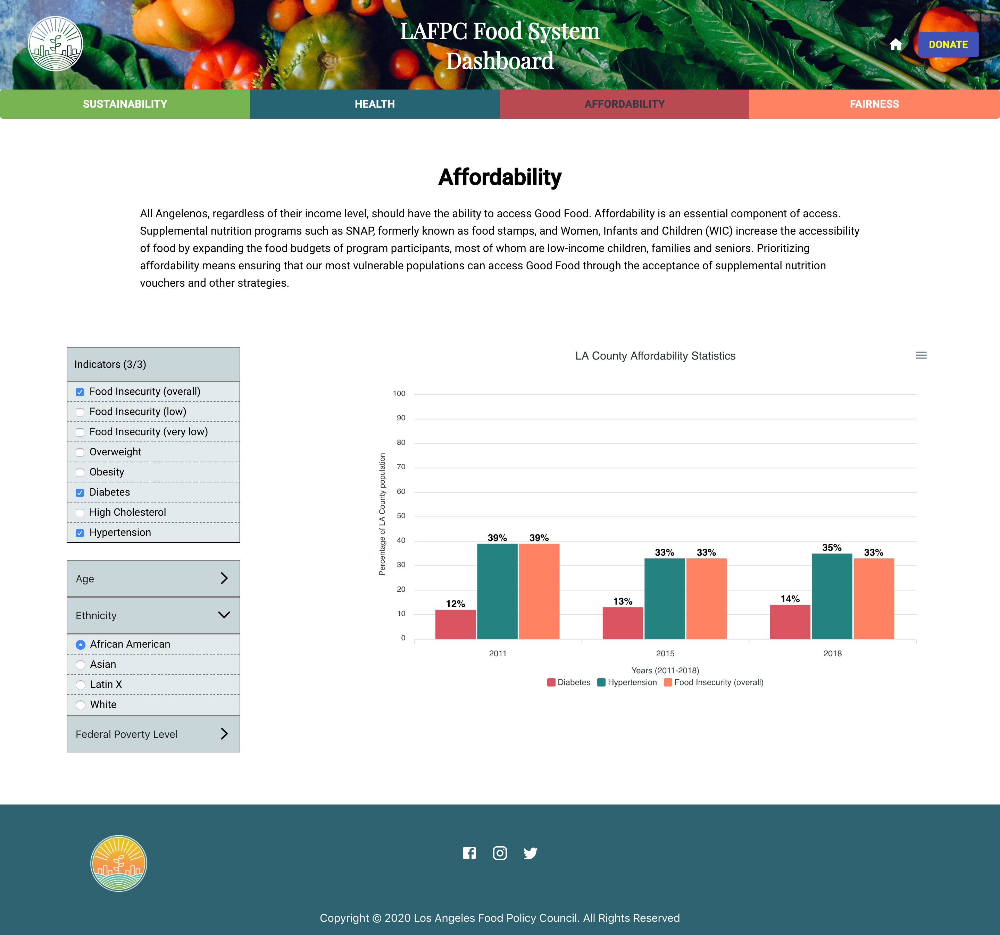

# Good Food LA

The Los Angeles Food Policy Council (LAFPC) works to ensure food is healthy, affordable, fair and sustainable for all.
This website is a dashboard for everyone in the Los Angeles community to see how the Los Angeles Food Policy Council's initatives improve the health and life of their communities.




## Technologies
### Front-End (User Interface)
* HTML5
* CSS3
* Material-UI (React.js UI Framework)
* JavaScript
* React.js
* Styled Components (React)
* ApexCharts

### Back-End (Server-Side and Database)
* MongoDB (NoSQL Database)
* Express.js
* Node.js
* Mongoose (Models)

## Goals
* Implement scalable data inputs
* Convey data about food policy in an easy to understand matter
* Debug layouts (HTML) and styling (CSS).

### User Stories
* On the homepage, the user is able to read the values of Good Food LA:
Sustainability, Health, Affordability, and Fairness.
* The user can see a Navigation Bar at the top that contains the logo, a home button, and an admin button.
* The user is able to see four tabs for each of the values (Sustainability, Health, Affordability, Fairness). Upon clicking, the tab is shaded, and the content in the center of the page changes with detailed descriptions of each value.
* The user should be able to see the data in a clean and simplified graph.
* Table columns are divided by indicator, year, and trend.
* Data tables near the bottom of the page rely on collapsible menus. They hide specific neighborhoods when closed.
* Main categories of info are collapsable by clicking the minus "-". When opened, they show specific regions associated with the main category.
* Emotions and shading portray changes in trends in the data from year to year. Positive emotions (smiley face) represent an increase, "so-so" emotions represent no change, and negative emotions represent a decrease.


### MVC Data
* Admin Model
```
const adminSchema = new mongoose.Schema({
  username: String,
  password: String
})
```
* Data Model
```
const dataSchema = new mongoose.Schema({
  indicator: String,
  baseline:  String,
  update:   [ String ],
  sources: String,
  change: String,
  notes: String,
  dataStatus: String,
  group: String,
  value: String,
})
```
